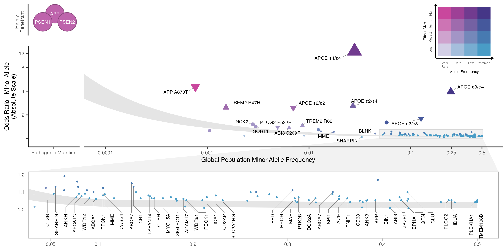

# Genetic architecture of Alzheimer's disease

Snakemake workflow for investigating the genetic architecture of Alzheimer's disease across multiple genome-wide association studies. 

## Workflow

Rules for defining the workflow are in `workflow/Snakefile` and the individule script files used by specific rules are avaliable in `workflow/scripts/`. The general steps are: 

1. **Data cleaning**: Lead SNPs identified by each GWAS are extracted from the PDF of the corresponding publication. Lift-over to build GRCh37 and effect allele standardiztaion and harmoniztion is conducted using `MungeSumstats`.
- Genome-wide association studies of Alzheimer's disease include: 
    - Lambert, J.-C. et al. Nat Genet 45, 1452–1458 (2013)
    - Marioni, R. E. et al. Translational Pscyh. (2018)
    - Jansen, I. E. et al. Nat Genet 51, 404–413 (2019)
    - Kunkle, B. W. et al. Nat Genet 51, 414–430 (2019)
    - Wightman, D. P. et al. Nat Genet 53, 1276–1282 (2021)
    - Bellenguez, C. et al. Nat Genet 54, 412–436 (2022)
- Additional studies of interest inlcude: 
    - Reiman, E. M. et al. Nat Commun 11, 667 (2020)
    - Jonsson, T. et al. Nature 488, 96–99 (2012).

2. **Annotation**: Lead SNPs are annotated with additional information
    - allele frequency from gnomAD 
    - predicted impact using snpEff
    - nearest protein-coding gene according to GENCODE release 40
    - cytogenic band from UCSC Genome Browser
    - Loci were defined by merging overlapping regions +/- 500kb around each lead variant from each study to obtain non-overlapping regions. 
    - LD pruning (EUR GRCh37 reference, r2 = 0.1, MAF = 0.001) using LDlink SNPclip was employed to define independent variants in each locus

The final list of variants can found in [`results/adgwas_loci.csv`](https://github.com/sjfandrews/ADGenetics/blob/main/results/adgwas_loci.csv)

3. **Power Curves**: Estimated detectable effect size at a given alelle frequency (MAF = 0.000001 - 0.5) and effective sample at 80% power

4. **Plotting**: Genetic architecture plots showing the allele spectrum (frequncy vs effect size) for single marker association results. Upset plots showing intersection of discovered loci across each GWAS. 

## Plots 

**Figure 1: Genetic architecture of AD/dementia highlighting ADAD mutations and 81 genome-wide significant loci.** Genetic variants associated with disease are often conceptualized along two dimensions - variant effect size and population minor allele frequency. Highly penetrant mutations in APP, PSEN1, PSEN2 that segregate with autosomal dominant AD are extremely rare and have large effect sizes. Variants discovered by genome-wide associations are mostly common to low-frequency with small effect sizes. To date, AD/dementia GWAS have identified 101 independent AD-associated single nucleotide polymorphisms across 81 genome-wide significant (p < 5e-8) loci. The shaded area illustrates 80% power to detect genome-wide significant association for variants at a given effect size and population frequency between an effective sample size of 382,472 from Bellenguez et al. (2022) (top) and 1 million (bottom), assuming 0.18 AD prevalence. Odds ratios are reported on the absolute scale, with triangles indicating directionality for APOE genotypes and rare variants with moderate-high SnpEff impact annotations. Effect sizes for APOE genotypes and APP Ala673Thr were obtained from (Reiman et al., 2020) and (Jonsson et al., 2012), respectively. Labeled loci indicate candidate causal genes prioritized by Bellenguez et al. (2022). Variant MAFs and APOE genotype frequencies were obtained from the gnomAD global population (GRCh37 v2.1.1).

**Figure 2: AD/dementia genome-wide significant loci. AD/dementia GWAS have found an increasing number of associated loci as effective sample size has increased, collectively identifying 101 independent variants across 81 loci.** Full points represent loci that reach genome-wide significance in a given study, and red points represent loci harboring multiple independent associated variants. Loci are labeled based on candidate causal genes prioritized by Bellenguez et al (2022). and Wightman et al (2022). 

**Figure 3. Human microglia signature genes in AD-/dementia-associated loci Increasing effective sample sizes for GWAS has resulted in the discovery of additional AD-associated genetic loci.** The most recent AD GWAS identified 82 independent signals across 75 loci (Bellenguez et al., 2022), with 17 of the loci containing candidate causal genes that are human microglia signature genes (Gosselin et al., 2017). The orange line illustrates the power to detect genetic variants at a given effect size and population frequency with an effective sample size of 382,472 from Bellenguez et al. (2022), assuming 80% power. This curve demonstrates that current GWAS are underpowered to detect rare variants. Labeled loci are those discussed in the main text or contain human microglia signature genes (highlighted in blue). Variant minor allele frequencies and APOE genotype frequencies were obtained from the gnomAD global population (GRCh37 v2.1.1). Effect sizes for APOE genotypes were obtained from Reiman et al., 2020. ll Neuron 110, November 2, 2022 3515

## Citation 

Andrews SJ, Renton A, Fulton-Howard B, Podlesny-Drabiniok A, Marcora E & Goate A. (2023). *The complex genetic architecture of Alzheimer's disease: novel insights and future directions.* [eBioMedicine 90, 104511](https://doi.org/10.1016/j.ebiom.2023.104511). 

Romero-Molina C, Garretti F, Andrews SJ, Marcora E & Goate AM. (2022). *Microglial efferocytosis: Diving into the Alzheimer’s disease gene pool*. [Neuron 110, 3513–3533](https://www.sciencedirect.com/science/article/pii/S0896627322009199).
  

Contributors: 
- Shea J. Andrews 
- Brian Fulton-Howard
- Alan E. Renton
