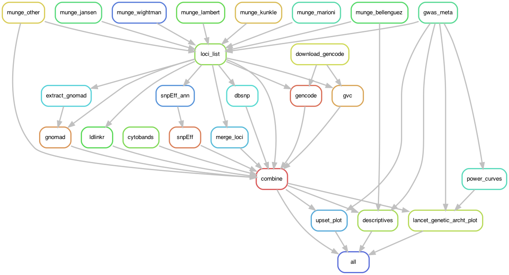

# Genetic architecture of Alzheimer's disease

Snakemake workflow for investigating the Genetic architecture of Alzheimer's disease across multiple genome-wide association studies. 

## Workflow

Rules for defining the workflow are `workflow/Snakefile` and the individule script files used by specific rules are avaliable in `workflow/scripts/`. The general steps are: 

1. **Data cleaning**: Lead SNPs identified by each GWAS are extracted from the PDF of the corresponding publication. Lift-over to build GRCh37 and effect allele standardiztaion and harmoniztion is conducted using `MungeSumstats`.
- Genome-wide association studies of Alzheimer's disease include: 
    - Lambert, J.-C. et al. Nat Genet 45, 1452–1458 (2013)
    - Marioni, R. E. et al. Translational Pscyh. (2018)
    - Jansen, I. E. et al. Nat Genet 51, 404–413 (2019)
    - Kunkle, B. W. et al. Nat Genet 51, 414–430 (2019)
    - Wightman, D. P. et al. Nat Genet 53, 1276–1282 (2021)
    - Bellenguez, C. et al. Nat Genet 54, 412–436 (2022)
- Additional studies of interest inlcude: 
    - Reiman, E. M. et al. Nat Commun 11, 667 (2020)
    - Jonsson, T. et al. Nature 488, 96–99 (2012).

2. **Annotation**: Lead SNPs are annotated with additional information
    - allele frequency from gnomAD 
    - predicted impact using snpEff
    - nearest protein-coding gene according to GENCODE release 40
    - cytogenic band from UCSC Genome Browser
    - Loci were defined by merging overlapping regions +/- 500kb around each lead variant from each study to obtain non-overlapping regions. 
    - LD pruning (EUR GRCh37 reference, r2 = 0.1, MAF = 0.001) using LDlink SNPclip was employed to define independent variants in each locus

3. **Power Curves**: Estimated detectable effect size at a given alelle frequency (MAF = 0.000001 - 0.5) and effective sample at 80% power

4. **Plotting**: Genetic architecture plots showing the allele spectrum (frequncy vs effect size) for single marker association results. Upset plots showing intersection of discovered loci across each GWAS. 

## Plots 

Figure 1: Allele sepctrum of Alzheimer's disease associated single nucleotide polymorphisms from genome-wide association studies of clincial- and proxy- dementia and family based studies of Autosomal Dominant AD. 

The intersection of AD-associated loci identified across genome-wide association studies.

## Citation 

WIP 

Contributors: 
- Shea J Andrews 
- Brian Fulton Howard